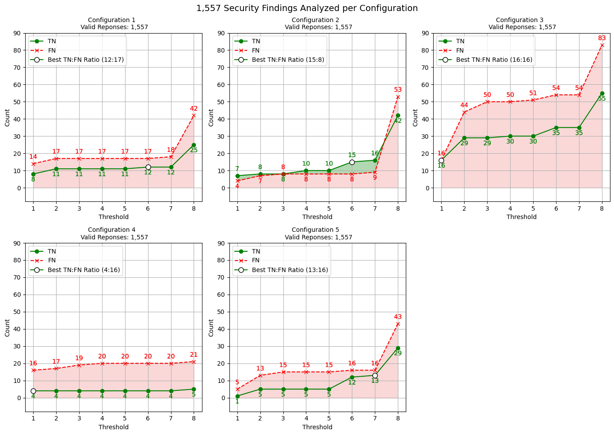

# Comparing Contextual Information

To first identify what specific contextual information can be of great interest for an LLM's assessment of security findings, we performed a preliminary experiment. The SAST tool we used on the OWASP Benchmark dataset, SpotBugs with the FindSecBugs plugin, provides the following contextual information about each finding:

1. Source code
2. Category
3. CWE-ID
4. Method
5. Line of Code
6. Type

We further decided to analyze whether additional information about a finding, queried by their CWE-ID from the CWE database, could improve the assessment of security findings by an LLM. The additionally fetched information for each CWE-ID present in the dataset is:

1. CWE Name
2. CWE Description
3. CWE Extended Description
4. CWE Demonstrative Examples

Ideally, we would have analyzed the differences between all possible combinations of these contextual information items. However, with 512 possible combinations, this exceeded the scope of our preliminary study. Therefore, based on certain assumptions, we created five different configurations of contextual information. These configurations differ in terms of size and sources of the context items. The idea underlying the configuration selection is that the first configuration should comprise a minimal number of items, exclusively drawn from the SpotBugs report. The selected items were “Source Code,” “Category,” and “CWE-ID.”

The second configuration was designed to contain the majority of items from the SpotBugs report, which resulted in adding the context items “Method,” “Line of Code,” and “Type” to the baseline configuration. This may provide insights into whether a minimal amount of contextual information about a security finding is sufficient for the LLM to determine if a finding is a false positive.

Subsequently, both of these configurations were extended with additional context items aggregated from the CWE database. The fourth configuration was created under the assumption that the CWE-related context items are more relevant than the SpotBugs items. Therefore, this configuration extended the baseline configuration with all given CWE database items.

Conversely, the fifth configuration was based on the assumption that the SpotBugs context items are more influential. Hence, this configuration included only a short description of the related CWE and its name.

Future work could include an exhaustive analysis of all possible combinations to obtain a more comprehensive understanding of the influence of different contextual information on an LLM's assessment of security findings. It could also be done with a more diverse set of LLMs, as all our experiments were conducted using GPT-3.5 Turbo.

| **Context Items**          | **Config 1** | **Config 2** | **Config 3** | **Config 4** | **Config 5** |
| -------------------------- | ------------ | ------------ | ------------ | ------------ | ------------ |
| Source Code                | ✓            | ✓            | ✓            | ✓            | ✓            |
| Category                   | ✓            | ✓            | ✓            | ✓            |              |
| CWE-ID                     | ✓            | ✓            | ✓            | ✓            |              |
| Method                     |              |              | ✓            |              | ✓            |
| Line of Code               |              | ✓            | ✓            | ✓            |              |
| Type                       |              | ✓            |              |              | ✓            |
| CWE Name                   |              |              | ✓            | ✓            | ✓            |
| CWE Description            |              |              | ✓            | ✓            | ✓            |
| CWE Extended Description   |              |              |              | ✓            | ✓            |
| CWE Demonstrative Examples |              |              |              |              | ✓            |

The results of our experiment, conducted on the [**train split**](../../../DATASETS.md), are stored in this directory. Each JSON comes with some metadata regarding our experiment. Further, each JSON contains a list of 1.557 test cases (few-shot examples already extracted) and for each of them the used prompt, the LLMs answer as well as the number of prompt and response tokens are provided. The used prompt template for this experiment is "default_prompt_template" presented [here](../../../src/prompt_templates.py).

We further provided one [exemplary prompt](./exemplary_prompt.py).

This [notebook](evaluation.ipynb) presents how the JSON can be used to extract our experiment results.

Finally the following image presents the results of each combination of contextual information across the thresholds 1-8, leaving out threshold 9 as it did not provide any valuable information.

