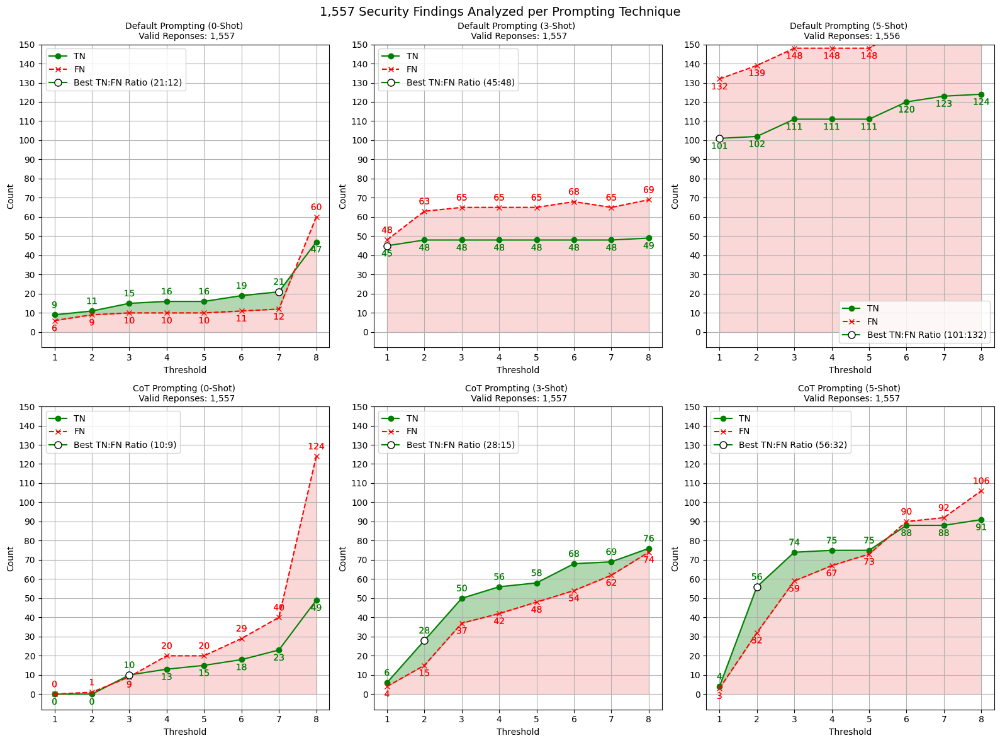

# Comparing Prompting Techniques

After comparing the impact of different contextual information, we proceeded to evaluate various prompting techniques to determine the most suitable approach for our use case. For this comparison, we used the same LLM as in the previous experiment, GPT-3.5 Turbo.

The prompting techniques selected for comparison include Few-Shot Prompting, Chain-of-Thought ([CoT](https://arxiv.org/abs/2201.11903)) Prompting, and Self-Consistency ([SC](http://arxiv.org/abs/2203.11171)). To facilitate CoT prompting, we designed a new prompt template, which can be found [here](../../../src/prompt_templates.py).

To enable repeating the experiment in a few-shot environment, we generated few-shot examples by following the [Auto-CoT](https://arxiv.org/abs/2210.03493) methodology. Using the CoT prompt template and GPT-4, we applied this approach to the [**train split** ](../../../DATASETS.md) of the OWASP Benchmark dataset. Since the dataset includes labeled test cases, we randomly selected five correct reasoning chains per CWE-ID. Given that the dataset contains 11 unique CWE categories, we extracted 55 distinct few-shot examples. These examples were then adapted: for the CoT template, they included the complete reasoning chain, whereas examples for standard prompting contained only the final decision value. All examples used in our experiments can be found [here](../../../src/few_shot_examples.py).

We acknowledge that a correct decision by the LLM does not necessarily imply a correct reasoning chain. However, we opted for automatic generation of few-shot examples due to the significant time and resource savings, which we believe outweigh the potential risk of incorporating incorrect reasoning chains.

Finally, we repeated the experiment on the training split of the OWASP Benchmark dataset using the previously identified most relevant contextual information. The details on how the JSON results can be extracted are provided in this [notebook](evaluation.ipynb). The figure below further visualizes the results of standard prompting compared to CoT prompting across the first eight thresholds.

The results indicate that 3-Shot CoT achieves the best performance, reaching a TN-FN ratio of approximately 1.86. Moreover, as shown in the provided [evaluation nootebok](evaluation.ipynb), 3-Shot CoT prompting produces a total of 7,969,063 prompt token, whereas 5-Shot CoT prompting produces a total of 12,289,222 prompt tokens. The computational cost of 3-Shot CoT is lower than that of 5-Shot CoT (~4,320,000 less prompt tokens), further reinforcing our decision that 3-Shot CoT is the optimal choice for our use case.

Additionally, the [notebook](evaluation.ipynb) demonstrates that SC, which involves repeating the experiment multiple times and selecting the most consistent answer, further improves overall performance.
