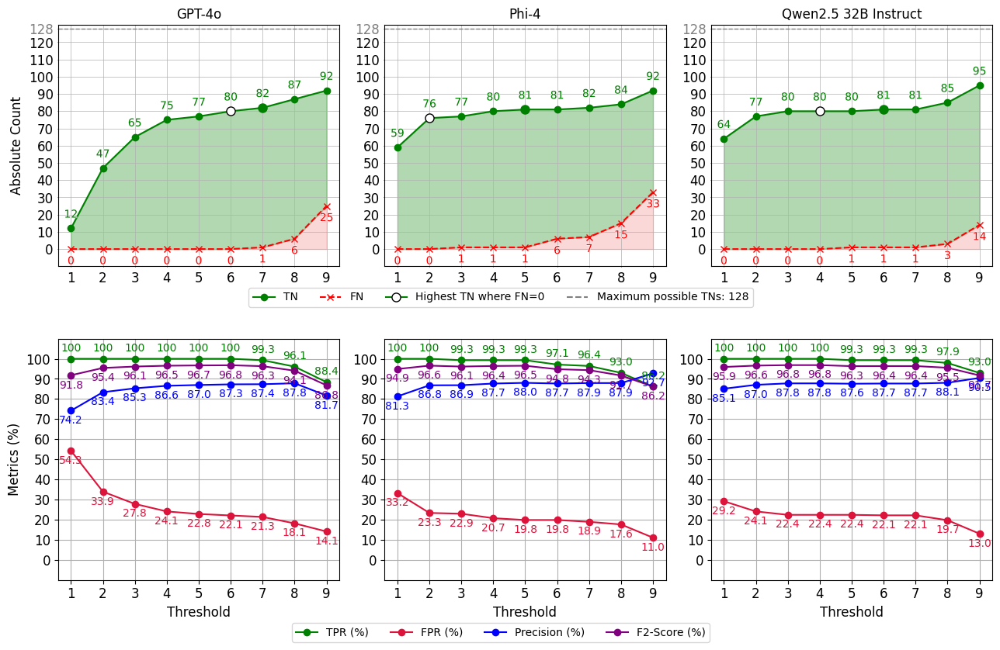

# Towars Efficient Complementary Security Analysis using Large Language Models

After our preliminary study, we utilized the identified contextual information and prompting technique to compare multiple LLM families on our **test split** dataset, which consists of 403 test cases across 11 vulnerability areas and on our **real-world dataset** (Mnestix), which consits of 114 real-world security findings. For more details about the datasets see: [datasets.md](../../DATASETS.md).

We have further prepared an [exemplary prompt](./exemplary_prompt.py) to show how we integrate the contextual information of a security finding into our prompt template.

We first compared different LLMs of various sizes and architectures in a 3-shot CoT setup. The results of this experiment are provided in the [results](./results/) and [self_consistency_results](./self_consistency_results/) directory.

After identifying Qwen2.5 32B, GPT-4o, and Phi-4 as the most accurate models for our use case, we repeated our 3-shot CoT experiment using the SC approach, which further improved the performance of the selected models. The provided [evaluation.ipynb](evaluation.ipynb) notebook demonstrates how to utilize our data and print the results for each model across all possible thresholds.

The following figure visualizes the results of GPT-4o, Qwen2.5 32B, and Phi-4 in the SC environment across various thresholds.

The provided [evaluation.ipynb](evaluation.ipynb) notebook presents the SC results of GPT-4o, Qwen2.5 32B, and Phi-4 on a [real-world dataset](../../DATASETS.md). This dataset was created by applying a variety of SAST tools to **Mnestix**, an open-source project developed by XITASO GmbH.

Not every SAST tool provides all contextual information used in the previous experiment. For this reason, the contextual information included in our prompts may vary from tool to tool. As explained in the provided [evaluation.ipynb](evaluation.ipynb) notebook, we mapped the information from each SAST tool to our context items identified in our [preliminary study](../preliminary_study/contextual_information_experiment/README.md). This can lead to instances where some contextual information is missing, as it may simply not be provided by the tool. The distribution of our previously used contextual information across the newly used SAST tools is visualized in the table below.

| SAST Tool                 | Source Code | Category | CWE-ID | Method | Line of Code | Type |
| ------------------------- | ----------- | -------- | ------ | ------ | ------------ | ---- |
| CodeQL                    | ✓           | ✓        | ✓      |        | ✓            | ✓    |
| Semgrep                   | ✓           | ✓        | ✓      |        | ✓            | ✓    |
| KICS                      | ✓           | ✓        |        |        | ✓            | ✓    |
| Checkov                   | ✓           |          |        |        | ✓            | ✓    |
| SpotBugs with FindSecBugs | ✓           | ✓        | ✓      | ✓      | ✓            | ✓    |
